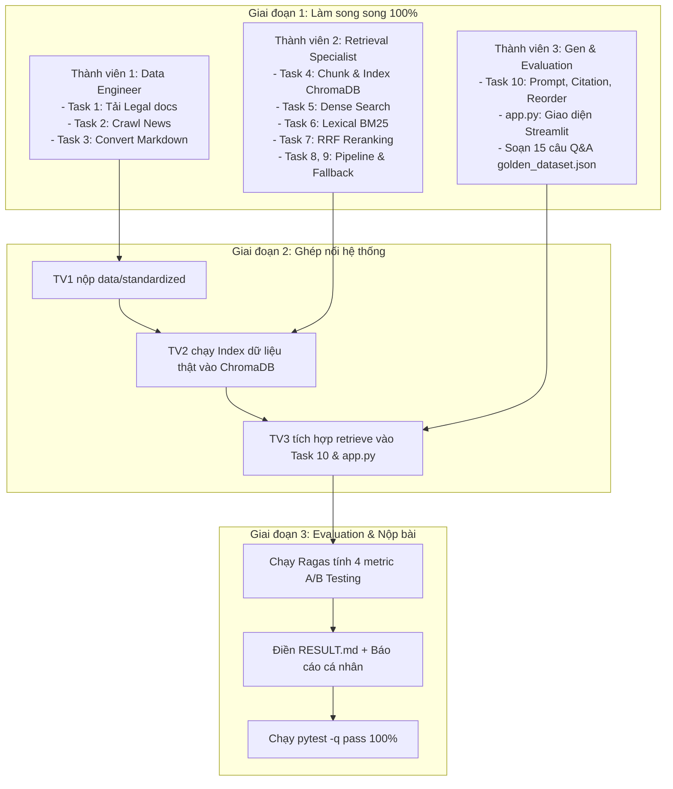

# Kế Hoạch Triển Khai & Phân Công Nhiệm Vụ — Day 8 RAG Pipeline

---

## 1. Tổng quan & Mục tiêu dự án
* **Mục tiêu:** Xây dựng hệ thống Chatbot RAG hoàn chỉnh end-to-end với Hybrid Retrieval (Dense + BM25), RRF Fusion, Fallback threshold, LLM Generation có trích dẫn nguồn (citation), giao diện Streamlit và báo cáo đánh giá định lượng A/B testing.
* **Thời lượng hoàn thành dự kiến:** 3 giờ.
* **Quy mô nhóm:** 3 thành viên.

---

## 2. Sơ đồ phối hợp tổng thể



---

## 3. Phân công nhiệm vụ chi tiết (Task Assignment)

### 👤 Thành viên 1: Data Engineer (Thu thập & Chuẩn hóa Dữ liệu)
* **Trách nhiệm chính:** Thu thập nguồn tài liệu thô, crawl bài viết và chuẩn hóa toàn bộ sang Markdown.
* **Chi tiết công việc:**
  - [ ] **Task 1 (`src/task1_collect_legal_docs.py`):**
    - Tải tối thiểu **3 văn bản chính sách/quy định** (PDF/DOCX) vào `data/landing/legal/`.
    - Dung lượng mỗi file phải > 1024 bytes.
  - [ ] **Task 2 (`src/task2_crawl_news.py`):**
    - Crawl tối thiểu **5 bài viết/tin tức** lưu vào `data/landing/news/*.json`.
    - Mỗi file JSON phải đủ các trường: `url`, `title`, `date_crawled`, `content_markdown`.
  - [ ] **Task 3 (`src/task3_convert_markdown.py`):**
    - Chuyển đổi toàn bộ tài liệu sang Markdown lưu vào:
      - `data/standardized/legal/*.md` (≥ 3 file)
      - `data/standardized/news/*.md` (≥ 5 file)
    - Mỗi file Markdown chuẩn hóa phải dài ≥ 200 ký tự.
* **Thời gian hoàn thành:** Phút 0 – 35.
* **Bàn giao (Hand-off):** Thư mục `data/standardized/` hoàn chỉnh cho Thành viên 2 và gửi các link/tài liệu cho Thành viên 3 để soạn câu hỏi.

---

### 👤 Thành viên 2: Retrieval & Search Specialist (Core Search Engine)
* **Trách nhiệm chính:** Xây dựng lõi tìm kiếm vector, BM25, RRF fusion và fallback pipeline.
* **Chi tiết công việc:**
  - [ ] **Task 4 (`src/task4_chunking_indexing.py`):**
    - Cài đặt `load_documents()`, `chunk_documents()`, `embed_texts()` (dùng `sentence-transformers` bge-m3 hoặc provider khác).
    - Tạo ChromaDB persistent collection với `cosine` distance và upsert dữ liệu.
  - [ ] **Task 5 (`src/task5_semantic_search.py`):** Cài đặt hàm `semantic_search(query, top_k)` từ ChromaDB.
  - [ ] **Task 6 (`src/task6_lexical_search.py`):** Cài đặt hàm `lexical_search(query, top_k)` bằng thuật toán BM25 trên tập chunks.
  - [ ] **Task 7 (`src/task7_reranking.py`):** Cài đặt hàm `rerank_rrf(ranked_lists, top_k, k=60)` gộp bảng xếp hạng theo chuẩn RRF: $\sum \frac{1}{k + rank}$.
  - [ ] **Task 8 (`src/task8_pageindex_vectorless.py`):** Cài đặt fallback tìm kiếm vectorless.
  - [ ] **Task 9 (`src/task9_retrieval_pipeline.py`):**
    - Ghép nối luồng: Dense + BM25 $\rightarrow$ RRF.
    - So sánh `best_dense_score` với `score_threshold`. Nếu nhỏ hơn, gọi Task 8 fallback.
* **Phương thức làm song song:** Tự tạo 1 file `.md` mẫu ngắn để test code. Kiểm tra tính tương thích liên tục bằng lệnh:
  ```bash
  pytest tests/test_contracts.py -q
  ```
* **Bàn giao (Hand-off):** Hàm `retrieve(query, top_k, score_threshold, use_reranking)` cho Thành viên 3.

---

### 👤 Thành viên 3: Generation, UI & Evaluation Specialist (LLM & Đánh giá)
* **Trách nhiệm chính:** Tích hợp sinh câu trả lời có trích dẫn nguồn, xây dựng giao diện Streamlit, thiết kế bộ test benchmark và báo cáo.
* **Chi tiết công việc:**
  - [ ] **Task 10 (`src/task10_generation.py`):**
    - `reorder_for_llm(chunks)`: Sắp xếp lại chunks (đưa tài liệu quan trọng lên đầu/cuối để giảm hiện tượng lost-in-the-middle).
    - `format_context(chunks)`: Định dạng context kèm Title và Source cụ thể.
    - Prompt LLM sinh câu trả lời kèm citation `[Document X]` hoặc từ chối trả lời an toàn (*safe refusal*) khi không đủ bằng chứng.
  - [ ] **Giao diện Chatbot (`app.py`):**
    - Tích hợp giao diện Streamlit: chat input, hiển thị câu trả lời.
    - Hiển thị danh sách nguồn tham khảo (*sources*), phương thức retrieval (*dense/hybrid/pageindex*) và điểm số (*score*).
  - [ ] **Soạn Golden Dataset (`group_project/evaluation/golden_dataset.json`):**
    - Viết tối thiểu **15 câu** dựa trên tài liệu của TV1.
    - Mỗi item có cấu trúc: `{"question": "...", "expected_answer": "...", "expected_context": "..."}`.
  - [ ] **Chạy Evaluation & Hoàn thiện báo cáo (`reports/RESULT.md`):**
    - Đánh giá 4 metric tiêu chuẩn: Faithfulness, Answer Relevance, Context Recall, Context Precision (sử dụng thư viện `ragas`).
    - So sánh A/B giữa **Config A** (Dense-only) và **Config B** (Hybrid + RRF).
    - Phân tích tối thiểu 3 ca lỗi tệ nhất (*Worst performers*) và viết khuyến nghị cải thiện.
* **Phương thức làm song song:** Mock tạm kết quả `retrieve()` trả về 2-3 chunk giả lập để hoàn thiện Task 10 và `app.py` trước khi TV2 bàn giao pipeline thật.

---

## 4. Lộ trình thời gian chi tiết (Timeline 180 phút)

| Mốc thời gian | Hoạt động chính | Sản phẩm cần đạt |
| :--- | :--- | :--- |
| **0 – 15 phút** | Thống nhất đề tài & Setup môi trường | - Chọn chủ đề, tạo file `.env` từ `.env.example`<br/>- Cả 3 người cài đặt `pip install -e ".[dev]"` |
| **15 – 50 phút** | **Giai đoạn 1: Làm song song** | - TV1: Hoàn thành Task 1, 2, 3 có dữ liệu trong `data/standardized/`<br/>- TV2: Hoàn thành Task 4, 5, 6, 7 (Pass `test_contracts.py`)<br/>- TV3: Hoàn thành Task 10 (Mock), `app.py`, soạn 15 câu Golden Dataset |
| **50 – 80 phút** | **Giai đoạn 2: Ghép nối (Integration)** | - TV2 index dữ liệu thật vào ChromaDB, hoàn thành Task 8, 9<br/>- TV3 nối `retrieve()` thật vào Task 10 & Streamlit<br/>- Chạy thử Chatbot `streamlit run app.py` |
| **80 – 130 phút** | **Giai đoạn 3: Đánh giá & Báo cáo** | - Chạy benchmark đo 4 metric trên 15 câu Golden Dataset<br/>- So sánh Config A (Dense) vs Config B (Hybrid+RRF)<br/>- Điền toàn bộ thông tin vào `RESULT.md` |
| **130 – 160 phút** | **Tính năng thưởng (Bonus)** *(Tùy chọn)* | - Làm HyDE (+3đ), Reranker nâng cao (+3đ), Memory (+2đ) hoặc UI Citation (+2đ) |
| **160 – 180 phút** | **Kiểm tra & Nghiệm thu** | - Chạy `pytest -q` kiểm tra toàn bộ test pass<br/>- Mỗi thành viên hoàn thành `INDIVIDUAL_REPORT.md`<br/>- Push repository lên GitHub |

---

## 5. Tiêu chí nghiệm thu (Definition of Done)

1. [ ] **Acceptance Test:** Lệnh sau phải vượt qua mà không có lỗi:
   ```bash
   pytest tests/test_contracts.py -q
   pytest tests/test_acceptance.py -q
   pytest -q
   ```
2. [ ] **Dữ liệu đầy đủ:**
   - `data/landing/legal/`: $\ge 3$ files (.pdf / .docx, dung lượng > 1024 bytes)
   - `data/landing/news/`: $\ge 5$ files (.json có metadata đầy đủ)
   - `data/standardized/`: $\ge 8$ files (.md có độ dài $\ge 200$ ký tự)
3. [ ] **Chatbot chạy ổn định:** `streamlit run app.py` hỏi đáp mượt mà, có citation rõ ràng, không bị crash khi fallback.
4. [ ] **Báo cáo sạch sẽ:** File `reports/RESULT.md` đã điền đầy đủ số liệu, xóa sạch chữ `TODO`.
5. [ ] **Báo cáo cá nhân:** Mỗi thành viên đều có commit riêng trên Git và hoàn thành `reports/INDIVIDUAL_REPORT.md`.
